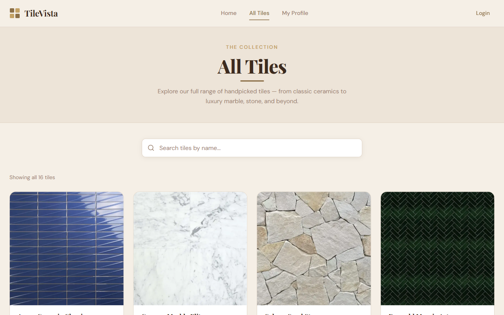
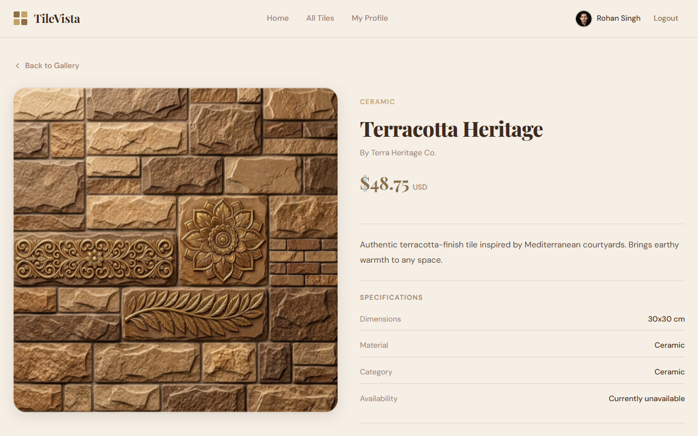

# TileVista 🏛️

> **Discover Your Perfect Aesthetic** — A premium tiles gallery web application built with Next.js 16 and modern web technologies.

[](https://tile-vista-pied.vercel.app)
[](https://nextjs.org)
[](https://react.dev)
[](https://mongodb.com)

---

## 📸 Screenshots





---

## 📋 Table of Contents

- [About the Project](#-about-the-project)
- [Live URL](#-live-url)
- [Features](#-features)
- [Tech Stack](#-tech-stack)
- [Project Structure](#-project-structure)
- [Pages & Routes](#-pages--routes)
- [NPM Packages](#-npm-packages)
- [Getting Started](#-getting-started)
- [Environment Variables](#-environment-variables)
- [Screenshots](#-screenshots)

---

## 🎯 About the Project

**TileVista** is a full-stack tiles gallery web application that allows users to browse, search, and explore a curated collection of premium tiles — from classic ceramics to luxury marble, natural stone, and beyond.

The project features a warm artisan–minimal design system with a custom color palette, editorial typography, and a responsive layout that works beautifully across all devices.

Built as a milestone project to demonstrate mastery of Next.js App Router, server-side rendering, authentication, protected routes, and modern React patterns.

---

## 🌐 Live URL

🔗 **[https://tile-vista-pied.vercel.app](https://tile-vista-pied.vercel.app)**

> **Note:** The JSON Server backend is deployed on Render. Initial load may take 30–50 seconds if the server is in a cold start state.

---

## ✨ Features

### Core Features

- 🏠 **Home Page** — Hero banner with SwiperJS fade slider, animated marquee ticker, and featured tiles section
- 🖼️ **Tiles Gallery** — Browse all 16 tiles with real-time client-side search by title
- 🔍 **Tile Detail Page** — Full tile details including title, creator, description, specifications, and tags
- 🔐 **Authentication** — Email/password login & registration with full validation
- 🔑 **Social Login** — Google and GitHub OAuth via BetterAuth
- 👤 **User Profile** — View and update profile name and photo URL
- 🛡️ **Protected Routes** — Proxy-based route protection for private pages

### UX Details

- ✅ Toast notifications for all user actions (success & error)
- ✅ Loading skeleton states on data fetching
- ✅ Active link highlighting in navbar
- ✅ Redirect back to intended page after login
- ✅ Sticky navbar with mobile hamburger menu
- ✅ Live image preview on profile update
- ✅ In-stock / out-of-stock badges on tile cards
- ✅ Custom 404 not-found page
- ✅ Fully responsive across all screen sizes

---

## 🛠️ Tech Stack

| Category       | Technology                        |
| -------------- | --------------------------------- |
| Framework      | Next.js 16 (App Router)           |
| Language       | JavaScript (ES6+)                 |
| Styling        | Tailwind CSS v4 + Custom CSS      |
| UI Library     | HeroUI v3                         |
| Icons          | Gravity UI Icons                  |
| Authentication | BetterAuth                        |
| Database       | MongoDB Atlas                     |
| Data Server    | JSON Server (deployed on Render)  |
| Animation      | SwiperJS                          |
| Deployment     | Vercel (client) + Render (server) |

---

## 📁 Project Structure

```
src/
├── app/
│   ├── (auth)/
│   │   ├── login/
│   │   └── register/
│   ├── (tiles)/
│   │   ├── all-tiles/
│   │   └── tile/[id]/
│   ├── my-profile/
│   │   └── update/
│   ├── layout.js
│   ├── page.js
│   ├── loading.js
│   └── providers.js
├── components/
│   ├── sharedComponents/
│   │   ├── Navbar.jsx
│   │   ├── Footer.jsx
│   │   ├── Banner.jsx
│   │   ├── MarqueeBanner.jsx
│   │   └── TileCard.jsx
│   ├── featureComponents/
│   │   └── FeaturedTiles.jsx
│   ├── allTilesComponents/
│   │   ├── AllTilesClient.jsx
│   │   ├── SearchBar.jsx
│   │   └── TilesGrid.jsx
│   ├── tileDetailComponents/
│   │   └── TileDetailView.jsx
│   └── profileComponents/
│       ├── MyProfileView.jsx
│       └── UpdateProfileForm.jsx
├── libs/
│   ├── auth.js
│   ├── auth-client.js
│   └── tilesData.js
├── styles/
│   ├── navbar.css
│   ├── banner.css
│   ├── marquee.css
│   ├── featured-tiles.css
│   ├── tile-card.css
│   ├── all-tiles.css
│   ├── tile-detail.css
│   ├── my-profile.css
│   └── login.css
└── proxy.js
```

---

## 🗺️ Pages & Routes

| Route                | Access     | Description                                 |
| -------------------- | ---------- | ------------------------------------------- |
| `/`                  | Public     | Home page — banner, marquee, featured tiles |
| `/all-tiles`         | Public     | Full gallery with search                    |
| `/login`             | Public     | Email/password + OAuth login                |
| `/register`          | Public     | User registration                           |
| `/tile/[id]`         | 🔒 Private | Single tile detail page                     |
| `/my-profile`        | 🔒 Private | Logged-in user profile                      |
| `/my-profile/update` | 🔒 Private | Update name and photo                       |

> 🔒 Private routes redirect unauthenticated users to `/login` via Next.js Proxy (`proxy.js`)

---

## 📦 NPM Packages

### Core

| Package     | Version | Purpose                         |
| ----------- | ------- | ------------------------------- |
| `next`      | 16.2.9  | React framework with App Router |
| `react`     | 19.2.4  | UI library                      |
| `react-dom` | 19.2.4  | React DOM renderer              |

### UI & Styling

| Package                | Version | Purpose                        |
| ---------------------- | ------- | ------------------------------ |
| `@heroui/react`        | ^3.1.0  | Component library              |
| `@heroui/styles`       | ^3.1.0  | HeroUI base styles             |
| `@gravity-ui/icons`    | ^2.18.0 | Icon set                       |
| `react-icons`          | ^5.6.0  | Additional icon library        |
| `tailwindcss`          | ^4      | Utility-first CSS framework    |
| `@tailwindcss/postcss` | ^4      | Tailwind CSS v4 PostCSS plugin |

### Authentication

| Package                      | Version | Purpose                                   |
| ---------------------------- | ------- | ----------------------------------------- |
| `better-auth`                | ^1.6.18 | Authentication library with OAuth support |
| `@better-auth/mongo-adapter` | ^1.6.18 | MongoDB adapter for BetterAuth            |
| `mongodb`                    | ^7.3.0  | MongoDB driver                            |

### Forms & Validation

| Package           | Version | Purpose                              |
| ----------------- | ------- | ------------------------------------ |
| `react-hook-form` | ^7.79.0 | Form state management and validation |

### Animation & UX

| Package              | Version | Purpose                               |
| -------------------- | ------- | ------------------------------------- |
| `swiper`             | ^12.2.0 | Touch slider for hero banner carousel |
| `react-fast-marquee` | ^1.6.5  | Scrolling ticker/marquee component    |
| `react-toastify`     | ^11.1.0 | Toast notification system             |

### Dev Dependencies

| Package                       | Version | Purpose                      |
| ----------------------------- | ------- | ---------------------------- |
| `eslint`                      | ^9      | Code linting                 |
| `eslint-config-next`          | 16.2.9  | Next.js ESLint configuration |
| `babel-plugin-react-compiler` | 1.0.0   | React compiler Babel plugin  |

---

## 🚀 Getting Started

### Prerequisites

- Node.js 18+
- npm or yarn
- MongoDB Atlas account
- Google OAuth credentials
- GitHub OAuth credentials

### Installation

**1. Clone the repository**

```bash
git clone https://github.com/your-username/tile-vista.git
cd tile-vista
```

**2. Install client dependencies**

```bash
cd client
npm install
```

**3. Install server dependencies**

```bash
cd ../server
npm install
```

**4. Set up environment variables**

Create a `.env.local` file in the client folder (see [Environment Variables](#-environment-variables) below).

**5. Run the JSON Server**

```bash
cd server
npm start
# Runs on http://localhost:5000
```

**6. Run the Next.js development server**

```bash
cd client
npm run dev
# Runs on http://localhost:3000
```

---

## 🔐 Environment Variables

Create a `.env.local` file in the client directory with the following variables:

```env
# API
NEXT_PUBLIC_API_URL=http://localhost:5000

# BetterAuth
BETTER_AUTH_SECRET=your_better_auth_secret_here
BETTER_AUTH_URL=http://localhost:3000

# MongoDB
MONGODB_URI=your_mongodb_connection_string

# Google OAuth
GOOGLE_CLIENT_ID=your_google_client_id
GOOGLE_CLIENT_SECRET=your_google_client_secret

# GitHub OAuth
GITHUB_CLIENT_ID=your_github_client_id
GITHUB_CLIENT_SECRET=your_github_client_secret
```

> ⚠️ Never commit your `.env.local` file to version control. It is already in `.gitignore`.

---

## 🎨 Design System

TileVista uses a custom **Warm Artisan–Minimal** design language:

- **Primary Font:** Playfair Display (headings, logo, hero text)
- **Body Font:** DM Sans (UI, paragraphs, labels)
- **Primary Color:** Terra Brown `#8B6F47`
- **Accent:** Sand Gold `#C4A265`
- **Background:** Cream White `#F5EFE6`
- **Text:** Deep Walnut `#3D2B1F`

All design tokens are defined as CSS custom properties in `globals.css` and registered with Tailwind CSS v4's `@theme` block for utility class generation.

---

## 👨‍💻 Author

Developed by Rohan Singh.

---

## 📄 License

This project is licensed under the **MIT License** — see the [LICENSE](./LICENSE) file for details.

[](https://opensource.org/licenses/MIT)
